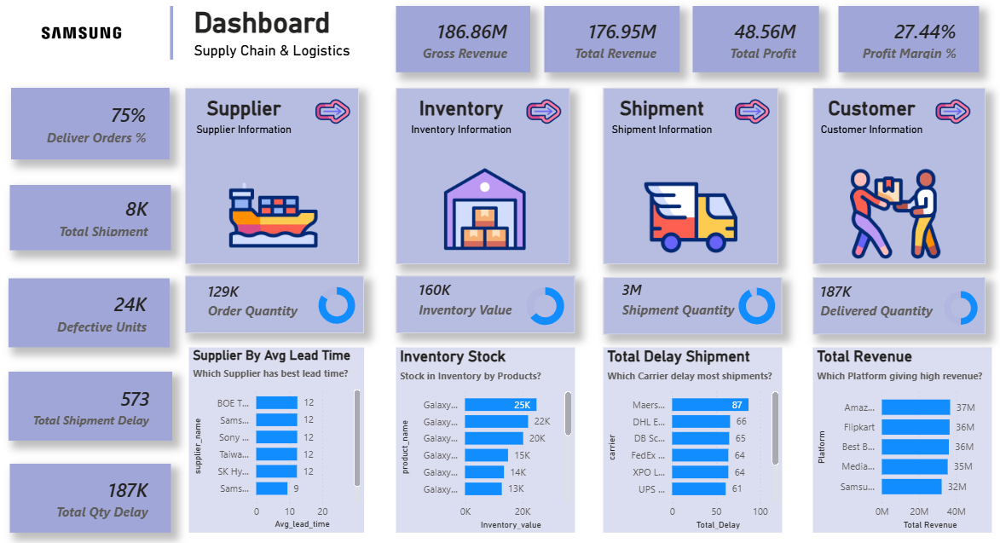
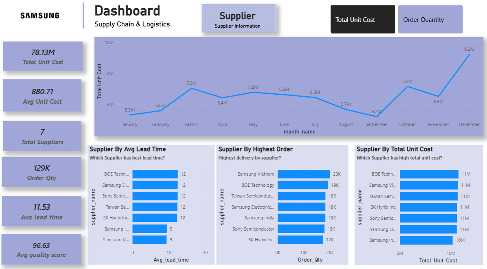
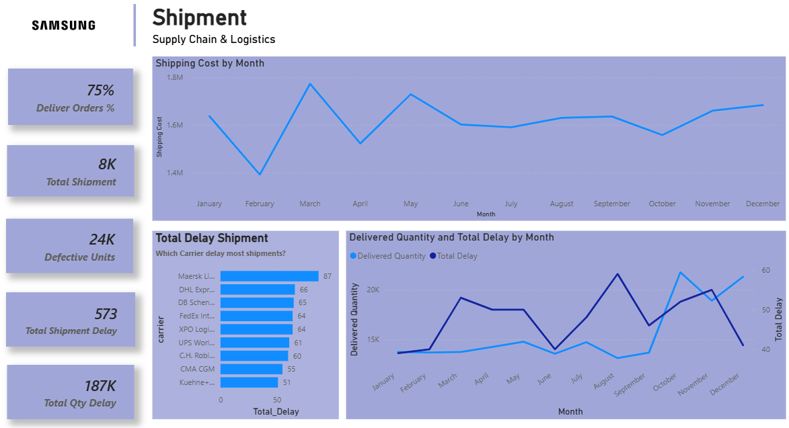
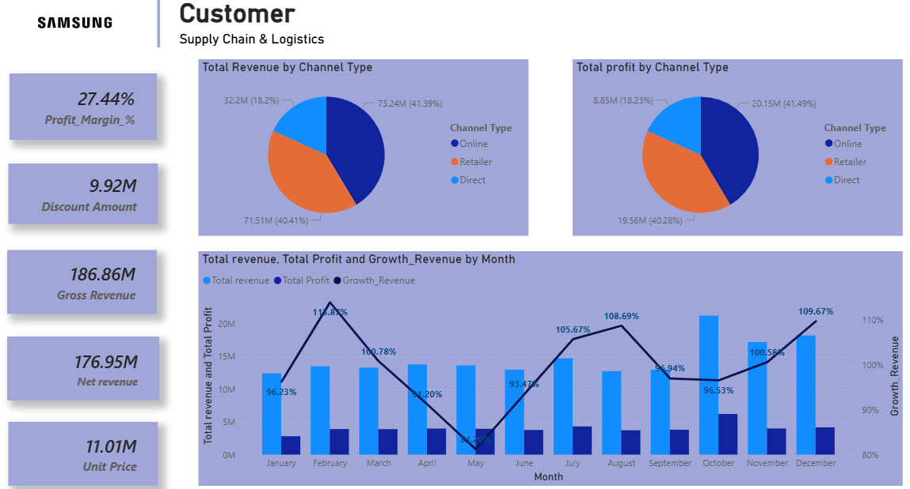

# Samsung Supply Chain & Logistics Dashboard (Power BI)

## Project Overview

This project presents an end-to-end **Supply Chain & Logistics Analytics Dashboard** built using **Power BI**.

The dashboard analyzes multiple operational areas including:

* Supplier performance
* Inventory management
* Shipment logistics
* Customer revenue
* Supply chain efficiency

The dataset is **synthetic and created only for analytical practice**.

---

## Tools & Technologies

* Power BI
* DAX
* Power Query
* Data Modeling
* Supply Chain Analytics

---

## Key Business Questions

This dashboard helps answer:

* Which suppliers deliver fastest?
* Which suppliers contribute the most procurement cost?
* Which logistics carriers cause the most shipment delays?
* Which products have the highest inventory stock?
* Which customer channels generate the most revenue?

---

## Executive Dashboard

Key KPIs:

* Gross Revenue: **186.86M**
* Net Revenue: **176.95M**
* Total Profit: **48.56M**
* Profit Margin: **27.44%**
* Delivery Orders Rate: **75%**

---

## Supplier Performance Analysis

Insights:

* Samsung Vietnam and BOE Technology handle the highest order quantities.
* Average supplier lead time is **11.53 days**.
* Procurement cost peaks during **December**.

---

## Inventory & Production Analysis

Insights:

* Inventory value totals **160K units**.
* Safety stock peaks around **October**.
* Galaxy series products dominate inventory stock.

---

## Shipment & Logistics Analysis

Insights:

* Total shipments: **8K**
* Shipment delays: **573**
* Maersk and DHL show the highest shipment delays.

---

## Customer & Revenue Analysis

Insights:

* Online channel contributes the highest revenue share.
* Profit margin remains stable around **27%**.
* Revenue growth spikes during **February and December**.

---

## Files in This Repository

| File           | Description             |
| -------------- | ----------------------- |
| Dashboard.pbix | Power BI dashboard file |
| dataset.csv    | Sample dataset          |
| images         | Dashboard screenshots   |

---

## Note

This project uses a **synthetic dataset created for portfolio purposes** and does not represent real Samsung operational data.

---

## Author

Muhib Jabbar
Data Analyst | Power BI | SQL | Data Visualization
